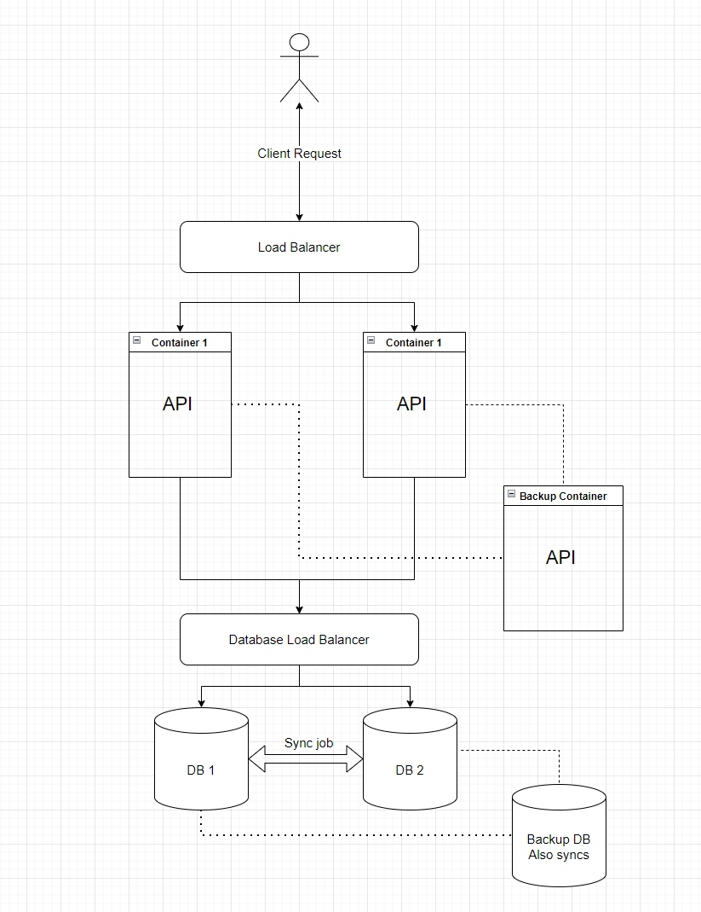
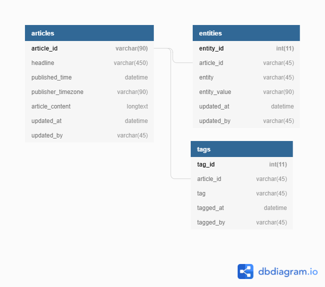

# Article Tagger

REST API built with flask, SQLAlchemy and MySQL database. 

The purpose of this API is for tagging articles found in a database. The project spins up a MYSQL database with dummy articles. The project goals and requirements are given in [instructions.md](instructions.md).

The application deploys two services defined in the `docker-compose.yaml` file. One to host the MySQL database and the other to host the flask API. 

## How to use
### Project Installation
Dependencies: Need docker installed.

1 - `git clone` this repository however you like

2 - Modify the `.env` in the root directory of the project. Fill in the environment variables as you would like.
 - MYSQL_DATABASE: Name of database to house data. Recommend something like: "article_tagger"
 - MYSQL_ROOT_PASSWORD: Root password of database upon creation. Recommend writing it on a piece of paper and putting it under your mattress (not really).
 - MYSQL_USER: Username for application user created upon database startup. Recommend something like: "myuser". 
   - *Note:* This user is a little over permissioned on the application database. Can be resolved by creating user in `init.sql` instead of relying on Docker. Not a big deal for this submission.
 - MYSQL_PASSWORD: Password for MYSQL_USER.
 - DATABASE_CONTAINER: Name of host container for database service. Used by application to connect to the database. Recommnd something like: "database_container"
 - API_CONTAINER: Name of host container for application.

3 - Run `deploy.sh`
 - This shell script does the following:
   1 - Creates a virtual environment with `virtualenv` called `venv` in the project root directory.
   2 - Installs requirements from `requirements.txt` file in project root directory to `venv`.
   3 - Activates the virtual environment
   4 - Builds docker images with `docker-compose build`
   5 - Spings up docker containers with `docker-compose up`

### API usage
Four endpoints are defined.

1 - /
 - Home - just displays a simple message

2 - /api/get_all_articles
 - Fetches all articles from `articles` table, returning only `article_id`, `headline` and `published_time` ordered by `published_time` in descending order (newest first).
 - Probably not a good idea to call once you have tons and tons of articles stored in the `articles` table since this is pretty close to a select *.
3 - api/search_articles
 - Fetches articles and its attributes based on given searched attributes.
 - Requires all search attribute as keys in the JSON body of the request. They are left as empty lists if not used.
   - All search attributes can take a list of attribute values to search on. 
   - Entities are given in a dictionary mapping the entity to the entity values to be searched on. 
   - `order_by_time` attribute can be set to "desc" or "asc" depending on how you want the reponse to be ordered in.
 - Example:
```
{
    "article_id": [],
    "headline": [],
    "published_time": [],
    "publisher_timezone": [],
    "tag": ["travel"],
    "tagged_by": [],
    "entity": {
        "city": ["montreal"],
        "topic": ["comedy"]
    }
    "order_by_time": "desc"
}
```

4 - /api/tag_article
 - Tags articles with provided tags in request.
 - Requset body contains a list of dictionary/hash maps mapping the `article_id` attribute with article id and the `tags` attribute with a list of tags.
 - Example:
 ```
 [
    {"article_id": "abc123", "tags": ["news", "global"]},
    {"article_id": "abc456", "tags": ["travel"]}
]
 ```

 *Sample requests can be found in `/tests/` folder*


## System Design

The application ships with the bare minimum infrastructure - a docker compose spawning two services, however the application itself can scale fairly easily (horizontally).

The below system diagram shows a potential setup for this application to address availability and scalability. In the below example, two instances of the application are hosted behind a load balancer (could use something like Ingress) with a third instance ready as a backup. If one of the two main instances would fail, the load balancer would route the traffic to the backup instance from the one that failed. Database interactions are also load balanced. The example below shows a set up with two database instances but it would also just be one database instance with a backup database. A single database instance would avoid issues with data syncronicity but could potentially hinder performance and be less reliable. A two database set up could lead to instances where race conditions occur and these are not currently handled by the application very well. The two database setup is high reliable on the other hand. A sync job keeps the two database instances coordinated and the backup database also gets synced (with a larger time interval between syncs).




## Database Design

The application uses a MySQL database. A relational database was chosen for two main reasons, query speed and my own level of expertise (I am much more comfortable using a relational db than a NoSQL db, although I have always wanted to learn more and practice with NoSQL databases, this was just not the time for it). A relational database does allow for straight forward indexing which should keep query speeds high as the application scales and the database becomes larger. Storing large indexes may be a bit costly though. 

The `articles` table has `article_id` as the primary key. It is also indexed on `published_time` and `published_timezone` (not sure if this one was necessary) in order to speed up queries based on how recent the news article is and being able to return queries ordered on `published_time`. Querying on `article_content` and `headline` is not very feasible with this design. Although, an index is imaginable for `headline`. `article_content` could also be stored elsewhere to keep row entries in this table as lean as possible. Long form text can be stored in a document store database mapping article_id to the text as an alternative. 

The `entities` table has `entity_id` as the primary key. It just serves as an int value primary key. It is also has a composite index on `entity` and `entity_value` as I would assume most use cases fall under the umbrella of searching for an entity with its entity value. It has a foreign key relationship between the `article_id` column and the primary key of `articles` table.

The `tags` table has a `tag_id` as the primary key. It is linked to the `articles` table through a foregin key on the `article_id` column. The table also has a uniqueness key between `article_id` and `tag` in order to ensure an article is not tagged multiple times with the same key. The table also has an index on `tag` in order to quickly find articles with specific tags. 

All tables also contain audit columns for recording when an entry was last updated and who performed the update.



## How it works

Two docker containers are spun up.

The first container houses a MySQL database. Upon launch, the database container runs the `init.sql` file under `mysql_db` folder of the project. This stored proc creates the tables with their relationships and indices along with dummy data.

The second container houses a REST API written with flask and SQLAlchemy (vanilla). The database connection is handled by the `EngineUtilities` base class. This base class is inherited by the `DatabaseUtilities` class which houses both the engine a host of helpful queries for the application. The `DatabaseUtilities` class is instantiated at the start up of the flask application in `article_tagger.py`. All API endpoints are defined in `article_tagger.py`. 


### Application functionality
#### Home and Fetch All
The home and query all articles functionalities are mostly trivial so I'll skip those.
 - Sample response of search all:
 ```
 {
    "content": [
        {
            "article_id": "abc456",
            "headline": "cool headline",
            "published_time": "Sat, 01 Jan 2022 11:59:00 GMT"
        },
        {
            "article_id": "abc123",
            "headline": "click baity headline",
            "published_time": "Fri, 01 Jan 2021 12:05:00 GMT"
        }
    ],
    "message": "All articles returned"
}
```
#### Search
The search function searches attributes in their respective attribute table (i.e. entities are searched for in the `entities` table) to determine all article ids matching searched attributes. We take the intersection of the resulting list of article ids to determine the article ids which satisfy all search criteria. We then build a response dictionary mapping the article_id with all its attributes. The response is returned in JSON.
 - Sample response:
 ```
{
    "content": {
        "abc456": {
            "article_content": "cool stuff",
            "article_id": "abc456",
            "entity": {
                "city": [
                    "montreal"
                ],
                "organization": [
                    "just for laughs"
                ],
                "topic": [
                    "comedy"
                ]
            },
            "headline": "cool headline",
            "published_time": "Sat, 01 Jan 2022 11:59:00 GMT",
            "publisher_timezone": "America/Montreal",
            "tags": [
                "travel"
            ]
        }
    },
    "message": "Search results returned"
}
```
### Tag Article
The tagging functionality takes a JSON request of articles and tags the user wishes to apply to it and performs a bulk insert on the database. The tagging will fail if request contains duplicate article tags (i.e. if an article has already been tagged with the same tag previously.) The response in this case is not very nice, the requester receives a generic 500 status code with a generic message and a stacktrace. **This can be improved by providing a custom response indicating a duplicate tag or can be handled by the application by skipping tags which are detected to already exist for an article.**. 
 - Sample response:
 ```
 {
    "inserted_tags": [
        {
            "article_id": "abc123",
            "tag": "news",
            "tagged_by": "myuser"
        },
        {
            "article_id": "abc123",
            "tag": "global",
            "tagged_by": "myuser"
        },
        {
            "article_id": "abc456",
            "tag": "travel",
            "tagged_by": "myuser"
        }
    ],
    "message": "Tagging succesful!"
}
 ```

 ## Tests

 I was not able to find time to build a test suite for this application as this project already took much longer than expected in an already busy week. However, I did include some sample test cases to interact with the application for *funsies*. They can be run like any other python3 file.

 ## Formatting

 The Python formatter black was used with a line limit of 100 on all Python files within the project.

 `black -l 100`